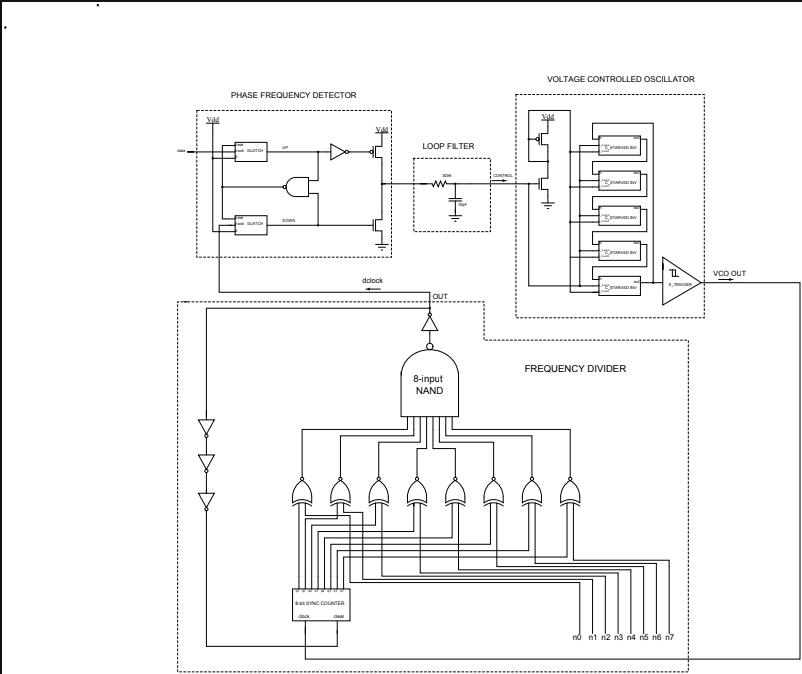

# 15 MHz Frequency Synthesizer Digital Phase Locked Loop (DPLL) in 130nm CMOS Technology

## Tools & Technologies Used
*   **[Skywater 130nm PDK](https://github.com/google/skywater-pdk)** – Target process node
*   **[Xschem](http://xschem.sourceforge.net/stefan/index.html)** – Schematic capture
*   **[Magic](http://opencircuitdesign.com/magic/)** – Layout design
*   **[Ngspice](http://ngspice.sourceforge.net/)** – SPICE simulation
*   **[Netgen](http://opencircuitdesign.com/netgen/)** – Layout vs. Schematic (LVS) verification

---

## Abstract

Digital Phase Locked Loops (DPLLs) are widely used in modern communication systems for applications such as:

- Frequency synthesis
- Carrier synchronization
- Jitter and noise reduction

This DPLL overcomes the disadvantages of traditional analog Phase Locked Loops (PLLs) by offering:

- Improved flexibility
- Wider frequency range
- Enhanced stability

## Project Focus

This project focuses on the design of a **low-power, small-size Digital Phase Locked Loop** implemented in **130nm Complementary Metal Oxide Semiconductor (CMOS) technology**. The DPLL is designed to generate **15MHz frequencies** under a **1.8V supply voltage**.

## Key Components

The DPLL incorporates the following elements:

- **Phase Frequency Detector (PFD)** – Uses D-latches to detect the phase difference between the reference signal and the feedback signal.
- **RC Loop Filter** – Ensures the stability of the system.
- **Voltage Controlled Oscillator (VCO)** – Produces oscillations with a maximum frequency of 15MHz.
- **Schmitt Trigger & Buffer** – Shapes the output pulses into clean digital pulses.
- **Frequency Divider** – Divides the output frequency by integer values ranging from **1 to 256**.

Below is a block diagram of the Digital Phase locked Loop

*Figure: DPLL*
